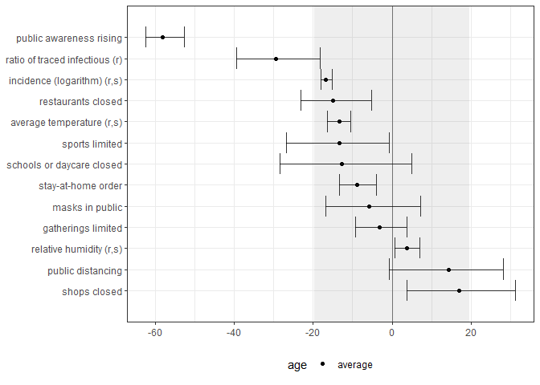
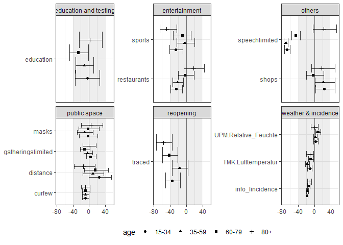

<!-- README.md is generated from README.Rmd. Please edit that file -->

# Inference under Superspreading

<!-- badges: start -->
<!-- badges: end -->

This repository provides replication code for the paper “Inference under
Superspreading” by [Patrick
Schmidt](https://sites.google.com/view/patrickschmidt/home).

## Installation

You can replicate the paper by downloading all relevant files from
[GitHub](https://github.com/Schmidtpk/InfSup) and installing the
package. You can use the command

``` r
# install.packages("devtools")
devtools::install_github("Schmidtpk/InfSup")
```

Then, get the R-package containing all data from
[CovidGer](https://github.com/Schmidtpk/CovidGer).

## Structure

All data for replication is gathered in a separate R-package
[CovidGer](https://github.com/Schmidtpk/CovidGer). This includes case
data by the Robert Koch Institute, weather data by the German Weather
Service (DWD), and data on policy interventions. All data is available
on state and county level. The case data contains date of symptom onset,
date of reporting, death, and age brackets.

Preparation of data and execution of MCMC sampling can be found in the
folder `jags models/submission/run model.R`. The JAGS model can be found
in the same folder and is named `jags base error.R`.

The replication code of all figures, tables, and quantitative statements
is provided in `analysis/plots.R`.

## How to anlyse the data

The MCMC sampling runs several days. The sample MCMC chain along with
other information on the model is saved in the repo and can be analyzed
directly.

The main plot in paper is generated with the function
`show_effects_sample`, which can average age-specific effect estimates.

``` r
library(InfSup)
library(tidyverse)
#> Warning: package 'tidyverse' was built under R version 4.1.3
#> Warning: package 'tibble' was built under R version 4.1.3
#> Warning: package 'tidyr' was built under R version 4.1.3
#> Warning: package 'readr' was built under R version 4.1.3
#> Warning: package 'dplyr' was built under R version 4.1.3
#> Warning: package 'stringr' was built under R version 4.1.3
#> Warning: package 'forcats' was built under R version 4.1.3

#load data and macro information about model
load("./jags models/submission/save/submission.RData")

cov.main<-c("UPM.Relative_Feuchte",
            "TMK.Lufttemperatur",
            "info_lincidence",
            "traced",
            "speechlimited",
            "narrowtesting",
            "shops",
            "sports",
            "gatheringslimited",
            "restaurants",
            "distance",
            "masks",
            "churchesopen",
            "schoolsopenlimited",
            "curfew",
            "education")

# show average effects ordered by size
show_effects_sample(cov.choice = cov.main,
                    average.age = TRUE,
                    order = TRUE)
#> Warning: `position_dodge()` requires non-overlapping x intervals
```



Alternatively, the results can be shown for all age groups separatedly:

``` r

show_effects_sample(cov.choice = cov.main)
```



For continuous variables, it is interesting to see how the total effect
of a covariate changed over time. The function `show_total_effect` takes
the model inputs and computes and plots their effect over time based on
the estimates in the model. It averages over all locations if average_c
is TRUE and over all age groups if average_age is TRUE.

``` r
show_total_effect(average_c = TRUE,
                  average_age = TRUE,
                  covariates = c("traced"))
#> Warning: Duplicated aesthetics after name standardisation: alpha
```


For the weather variables the function can forecast the total effect
based on past weather of the last years.

``` r
show_total_effect(covariates = macro$cov.weather,
                  average_age = TRUE,
                  forecast = TRUE,
                  smooth = 14)
#> Warning: Duplicated aesthetics after name standardisation: alpha
```


